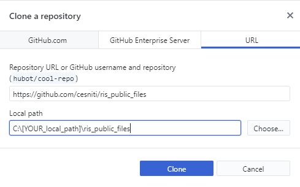

# River information Service (RIS) public website

The architecture of the www.ris.eu is presented as a continuous improvement projet (open). 
The files have been extracted from the previous web site (CMS based). 
The objective is to transfer of all important files to the new architecture in a harmonised and understood manner.

The current tree of the content is displayed below : 

	.
	├── Subsite Temporary working groups					# Sub website dedicated to working groups ie. ris.cesni.eu
		├── index.html 	(introduction)
		├── 30-en.html 	(RIS)							
		├── 31-en.html 	(CESNI-TI RIS | Inland ECDIS)	
		├── 312-en.html (CESNI-TI RIS | INLAND ECDIS DOCUMENTATION)							
		├── 32-en.html 	(CESNI-TI RIS | ELECTRONIC SHIP REPORTING ERI)
		├── 322-en.html (CESNI-TI RIS | ELECTRONIC SHIP REPORTING ERI DOCUMENTATION)
		├── 33-en.html 	(CESNI-TI RIS | NOTICES TO SKIPPERS NtS)
		├── 332-en.html (CESNI-TI RIS | NOTICE TO SKIPPERS NTS DOCUMENTATION)
		├── 34-en.html 	(CESNI-TI RIS | VESSEL TRACKING AND TRACING VTT)
		├── 342-en.html (CESNI-TI RIS | VESSEL TRACKING AND TRACING VTT DOCUMENTATION)
		└── reference data [ToDO](https://github.com/cesniti/ris_public_files/projects/1)
		├── _assets
			├── ERI-ERINOT									# ERINOT xsd file as asset
			├── ERI-ERIVOY									# ERIVOY xsd file as asset
			├── ERI-PAXLST									# PAXLST xsd file as asset
			├── NtS-MS										# NtS web service definition
			├── NtS_XSD										# NtS XSD files
			├── NtS_NtS_XML_Schema_Definition_XSD			# NtS Schema in an excel file
			└── NtS_NtS_web_service_specification_WSDL		# NtS the web service specification
		├── docs
			├── File										# Inherited files are stored in this folder for download
			└── Image										# All image stored in this folder are related (previous website)
		├── css												# web css files
		├── images											# Images related to current template
		└── scripts											# Script related to current template

The new architecture simplify the references to files (the architecture is not depending on a CMS database).
The new set up of the files and website structure.
The content docs/File structure has been maintained to avoid duplication and simplify the usage of file links. 
The content (all files individually) of the whole website is time-stamped you can find the history of all changes / update here https://github.com/cesniti/ris_public_files/commits/master

## html files 

## assets
The assets are files which are needed for external use (such as webservices).
All assets are identified within a folder and a sub folder with its version.
Inside a version there could have different output of the same file XSD + html view (for the record).


# How to download a local version of the website on my desktop?
- Download the newest version of github desktop on your computer https://desktop.github.com/
- Install the software 
- clone the repository (CTRL+SHIFT+O)


# How to update the website with the content of github ? 
**FOR CESNI secretariat**: Login to the shell (using ssh / putty) of the website and execute the following commands :

```console
cd www
git pull
```

# The structure will contain submodule that the Temporary working group can update themselves :
- creation of cesniti twg repositories 
- list repository here 
- modify the git file to allow an update

Temporary working group ERI 

# Usefull
https://stackoverflow.com/questions/7813030/how-can-i-have-linked-dependencies-in-a-git-repo

# link to the dedicated website cesni/ti

	├── CESNI/TI											# Wordpress page dedicated to CESNI/TI (under activities/)
		├── Mission
		├── RIS Directive 
		├── Work programme
		└── Site Temporary working group					# Abstract work programme TI-1 to TI-4

